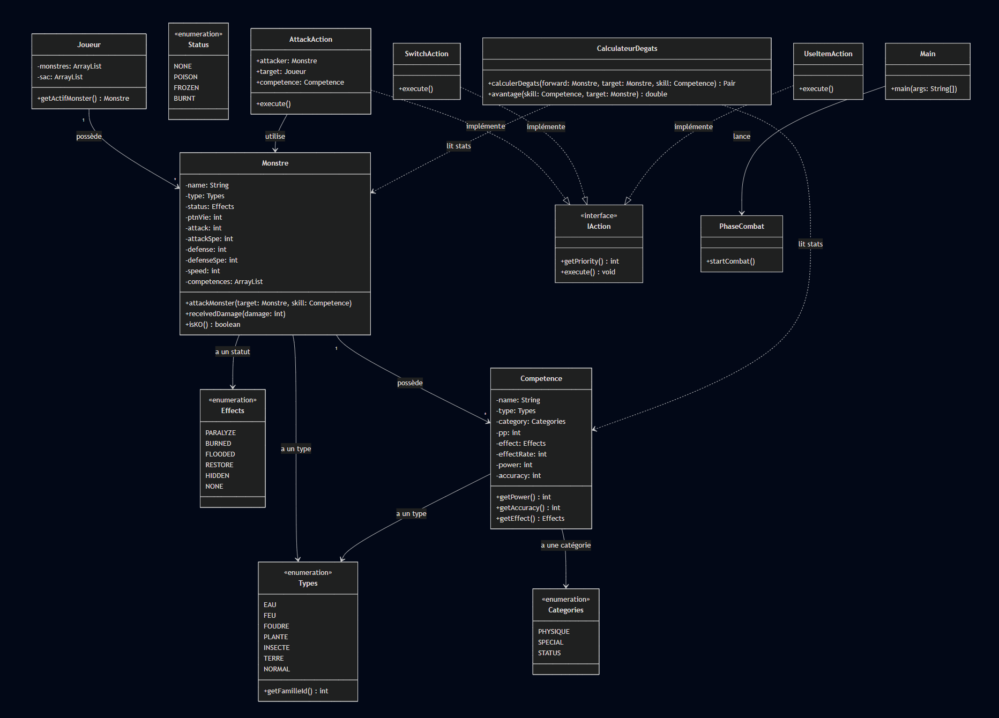

#  Monstre En Poche

Bienvenue dans **Monstre En Poche**, un projet de jeu de combat au tour par tour développé en Java, inspiré des mécaniques classiques de capture et de combat de monstres de poche.

Ce projet met en œuvre une architecture **Orientée Objet** robuste, simulant des affrontements stratégiques entre équipes de monstres.

## 📋 Fonctionnalités Principales

### 🎮 Système de Jeu
*   **Combat au Tour par Tour** : Système dynamique où chaque tour demande une décision stratégique.
*   **Gestion d'Équipe** : Chaque dresseur gère une équipe de monstres (jusqu'à 3 actifs) et un inventaire d'objets.
*   **Choix d'Actions** :
    1.  **Changer de Monstre** (Priorité haute)
    2.  **Utiliser un Objet** (Soin, Boost...)
    3.  **Attaquer** (Calculé selon la vitesse)

### 🐉 Les Monstres
Chaque monstre est défini par des attributs précis influençant son rôle au combat :
*   **Statistiques** : PV, Attaque, Défense, Attaque Spéciale, Défense Spéciale, Vitesse.
*   **Types Élémentaires** : Eau 💧, Feu 🔥, Foudre ⚡, Nature 🌿, Terre ⛰️, Normal ⚪.
*   **Compétences** : Chaque monstre possède jusqu'à 4 attaques uniques.

### ⚔️ Mécaniques de Combat Détaillées

#### 1. Calcul des Dégâts
Les dégâts sont calculés via une formule complexe qui prend en compte plusieurs facteurs pour garantir un équilibrage réaliste :

$$ Dégâts = \left( \frac{11 \times Puissance \times Attaque}{25 \times Défense} + 2 \right) \times Coef \times Efficacité $$

*   **Attaque / Défense** : Utilise soit les statistiques *Physiques*, soit *Spéciales* en fonction de la catégorie de la compétence.
*   **Coef (Aléatoire)** : Un multiplicateur entre 0.85 et 1.0 (actuellement fixé à 1 pour les tests) pour introduire une légère variation.
*   **Efficacité du Type** : C'est le cœur de la stratégie. Nous utilisons une matrice d'efficacité (Tableau 2D) croisant le type de l'attaque et le type du défenseur.
    *   **Super Efficace (x2)** : Ex: Eau sur Feu.
    *   **Neutre (x1)** : Ex: Normal sur Normal.
    *   **Pas très efficace (x0.5)** : Ex: Feu sur Eau.
    *   **Immunisé (x0)** : Ex: Foudre sur Terre (logique implémentée).

#### 2. Gestion Avancée des Types (Mécanique "STAB" et Passifs)
Au-delà de la table des types classique, nous avons implémenté une mécanique unique pour renforcer l'identité de chaque élément. Lorsqu'un monstre utilise une compétence de son propre type (**STAB** - *Same Type Attack Bonus*), un effet secondaire spécifique se déclenche :

*   **Logique Générale** : `Si (TypeMonstre == TypeAttaque)` alors on applique un effet spécial.
*   **Exemple du Type FEU 🔥** :
    *   Le jeu effectue d'abord un test de probabilité (20%).
    *   **Succès** : La cible reçoit le statut **BRÛLURE** (Dégâts continus).
    *   **Échec** : Pour compenser l'absence de statut, l'attaque inflige **10% de dégâts bruts supplémentaires**.
    *   *Note d'implémentation* : Cette double condition (Statut OU Dégâts) permet d'éviter qu'un tour soit "perdu" si le statut ne proc pas, rendant les monstres spécialisés toujours dangereux.

#### 3. Précision et Esquive
Chaque compétence possède un taux de précision. Le système intègre un jet de dés (RNG) pour déterminer si l'attaque touche ou échoue ("The attack missed !").

#### 3. Effets de Statut et Passifs de Type
Le jeu gère les altérations d'état (Brûlure, Poison, etc.). De plus, des mécaniques spécifiques aux types (STAB conditionnel) sont implémentées :
*   🔥 **Type FEU** : Lorsqu'un monstre Feu utilise une attaque Feu, il a **20% de chance de BRÛLER** la cible. Si l'effet ne s'applique pas, les dégâts sont augmentés de **10%**.

### 🛠️ Architecture Technique
*   **Chargement Dynamique** : Les données des monstres et compétences sont parsées depuis des fichiers `.txt`, permettant un équilibrage facile sans recompilation.
*   **Design Patterns** : Utilisation de modèles comme *Strategy* (IA), *Factory* (Création d'objets) et *State* (Gestion des phases de jeu).
*   **Tests Unitaires** : Validation des mécaniques critiques (ex: Calculs de dégâts, application des effets) via des classes de test dédiées.

## ⚙️ Prérequis et Compilation

Pour le bon fonctionnement du projet, veuillez noter les points suivants :

*   **Java SDK** : Le projet nécessite **Java 17** au minimum.
*   **Compilation** : Le programme doit être compilé et exécuté depuis le dossier `src` pour garantir le chargement correct des fichiers de ressources (chemins relatifs).

**Commandes recommandées :**
```bash
cd src
javac Main.java
java Main
```

---

## 📂 Structure du Projet

```text
Monstre_En_Poche/
├── src/
│   ├── Competences/    # Gestion des attaques et de leurs effets
│   ├── Joueurs/        # Logique des Dresseurs et Intelligences Artificielles
│   ├── Monstres/       # Entités Monstres et logique de stats
│   ├── PhaseJeu/       # Moteur de jeu (Combat, Tour par tour)
│   ├── Shared/         # Énumérations (Types, Effects) et Utilitaires
│   └── Tests/          # Tests unitaires et scénarios de validation
```

---

## 📊 Diagramme UML

L'architecture globale du projet est représentée ci-dessous :



## Produced by
- MANON-MAZA Noann
- MUZARD Thomas

Merci